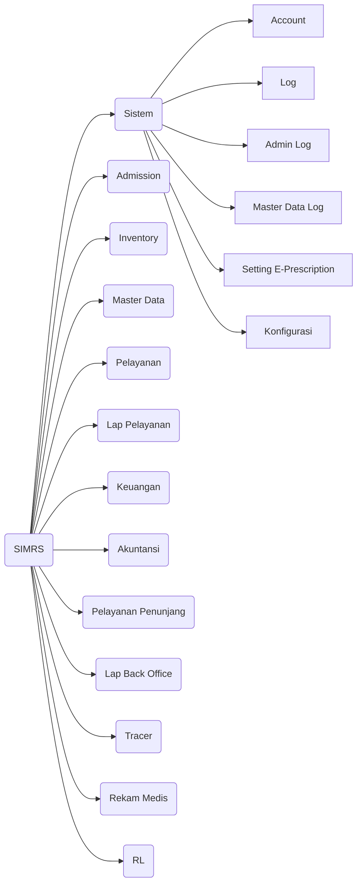

# Scratch Pad

- Menggunakan CodeIgniter
- Yang harus didokumentasikan
  - Modul-modul
  - Tables
  - Alur Program
  - Teknologi Apa saja yang digunakan
  - Sistem
- Tujuan pendokumentasian : agar pelacakan algoritma program mudah untuk dilakukan. Menemukan alur program yang redundant untuk diperbaiki di versi selanjutnya.
- Changelog dan Request Log
- Menggunakan metode Agile Development

## Modules `dc_module`
1. Sistem
2. Admission
3. Inventory
4. Master Data
5. Pelayanan
6. Lap. Pelayanan
7. keuangan
8. Akuntansi
9. Pelayanan Penunjang
10. Lap. Back Office
11. Tracer
12. Rekam medis
13. RL

## Technical Requirements

